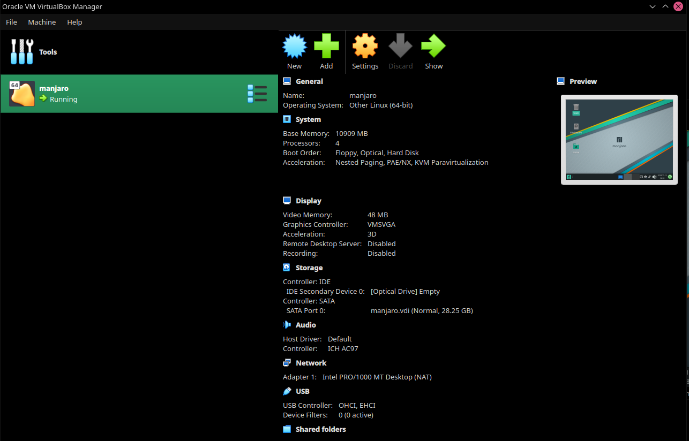
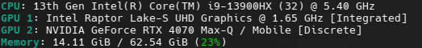
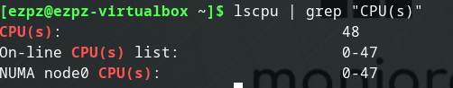
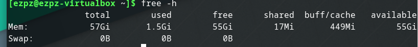

# KN01: Virtualisierung

## Hypervisor Typ 1 und 2

### Was ist ein Hypervisor?

Ein Hypervisor ist eine Software, die es ermöglicht, mehrere Betriebssysteme auf einem einzigen physischen Host auszuführen. Der Hypervisor wird auch als Virtual Machine Monitor (VMM) bezeichnet. Es gibt zwei Arten von Hypervisoren.

### Hypervisor Typ 1

Ein Typ-1-Hypervisor, auch bekannt als Bare-Metal-Hypervisor, ist eine Virtualisierungssoftware, die direkt auf der Hardware eines physischen Hosts installiert wird. Ein Typ-1-Hypervisor hat direkten Zugriff auf die Hardware des Hosts und benötigt kein Betriebssystem, um zu funktionieren. Typ-1-Hypervisoren sind in der Regel leistungsstärker als Typ-2-Hypervisoren, da sie direkt auf der Hardware laufen.

Beispiele:

- VMware vSphere/ESXi
- Microsoft Hyper-V
- Citrix XenServer

### Hypervisor Typ 2

Ein Typ-2-Hypervisor ist ein ghosteter Hypervisor, der auf einem Betriebssystem installiert wird. Dieser interagiert über das Betriebssystem des Hosts mit der Hardware. Er wird auf dem Computer installiert wo er als Anwenung ausgeführt wird. Typ-2-Hypervisoren sind in der Regel weniger leistungsstark als Typ-1-Hypervisoren, da sie über das Betriebssystem des Hosts laufen. Die Systemressourcen werden zwischen dem Betriebssystem und dem Hypervisor aufgeteilt, wobei das Betriebssystem priorisiert wird.

Beispiele:

- VMware Workstation
- Oracle VirtualBox

## Virtualisierungssoftware

Auf meinem System habe ich VirtualBox installiert und ein System mit Manjaro aufgesetzt:


_Abbildung 1: VirtualBox_

Diese Virtuelle Maschine ist ein Typ-2-Hypervisor, da VirtualBox auf meinem Host-Betriebssystem (NixOs) installiert ist.

### Ressourcen

Host-System:


_Abbildung 2: Host-System_

- Mein Host-System verfügt über 32 CPU-kerne und 64 GB RAM.

Nun füge ich der Virtuellen Maschine mehr Ressourcen hinzu als mein Host-System hat:


_Abbildung 3: Erhöhung der Prozessoren_

Das System lässt sich starten und führe folgenden Befehl aus:

```bash
lscpu | grep "CPU(s)"
```


_Abbildung 4: Ausgabe des Befehls `lscpu | grep "CPU(s)"`_

- Die Virtuelle Maschine zeigt 48 CPU-Kerne an, obwohl mein Host-System nur 32 CPU-Kerne hat.

Dies ist möglich, da die Virtuelle Maschine ein Typ-2-Hypervisor ist und die Ressourcen zwischen dem Betriebssystem und dem Hypervisor aufgeteilt werden.

Das Gleiche mache ich nun mit dem Arbeitsspeicher, diesen kann ich jedoch nicht bis auf einen gewissen Wert erhöhen:


_Abbildung 5: Erhöhung des Arbeitsspeichers über dem Limit_


_Abbildung 6: Fehlermeldung_

- Die Fehlermeldung zeigt, dass ich den Arbeitsspeicher nicht über ca. 60 GB erhöhen kann. Das liegt daran, dass eine VM nicht mehr Arbeitsspeicher haben kann als der Host-Computer zur Verfügung stellt. Die Virtuelle Maschine ist ein Typ-2-Hypervisor und teilt sich die Ressourcen mit dem Host-System. Würde eine VM mehr Arbeitsspeicher haben als der Host-Computer zur Verfügung stellt, würde das Host-System nicht mehr funktionieren.

Ich belasse den Arbeitsspeicher bei 60 GB, starte die Virtuelle Maschine und führe folgenden Befehl aus:

```bash
free -h
```


_Abbildung 7: Ausgabe des Befehls `free -h`_

- Die Virtuelle Machine zeigt mir 57GiB (60 GB) Arbeitsspeicher an.

> **Quellen:**
>
> - [Amazon Web Services](https://aws.amazon.com/de/compare/the-difference-between-type-1-and-type-2-hypervisors/)
