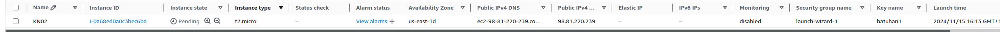
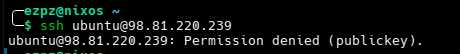
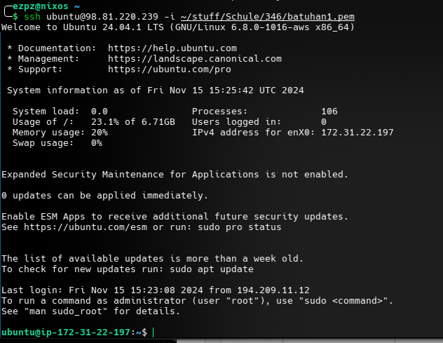
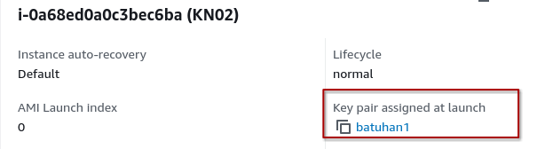

# KN02: laaS - Virtuelle Server

## Erstellung einer Instanz

Screenshot der Instanz:

_Abbildung 1: Instanz_

- Disk: 8 GB
- Betriebssystem: Ubuntu 24.04
- CPU: 1
- RAM: 1 GB

## Zugriff mit SSH-Key

Verbindung ohne SSH-Key:

_Abbildung 2: Verbindung ohne SSH-Key_

Verbindung mit dem ersten SSH-Key:

_Abbildung 3: Verbindung mit dem ersten SSH-Key_

Verbindung mit dem zweiten SSH-Key:

_Abbildung 4: Verbindung mit dem zweiten SSH-Key_

Verwendeter SSH-Key:

_Abbildung 5: Verwendeter SSH-Key_
