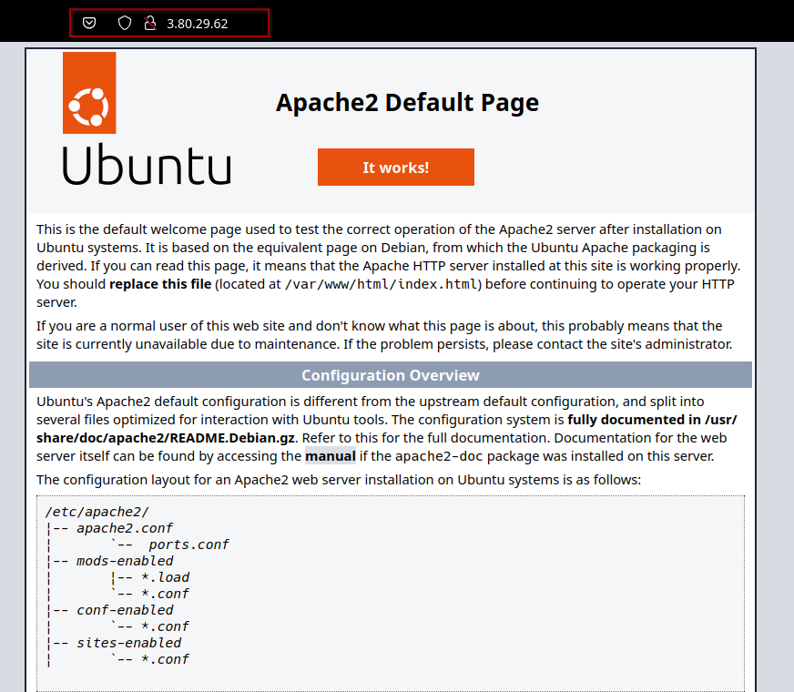
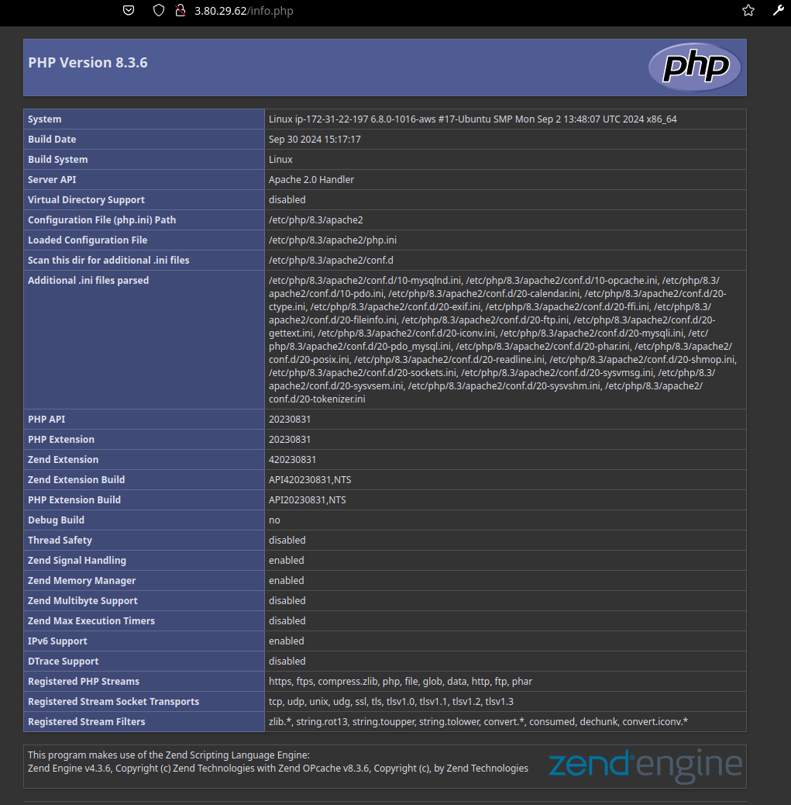
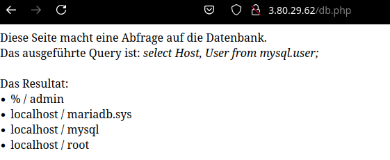
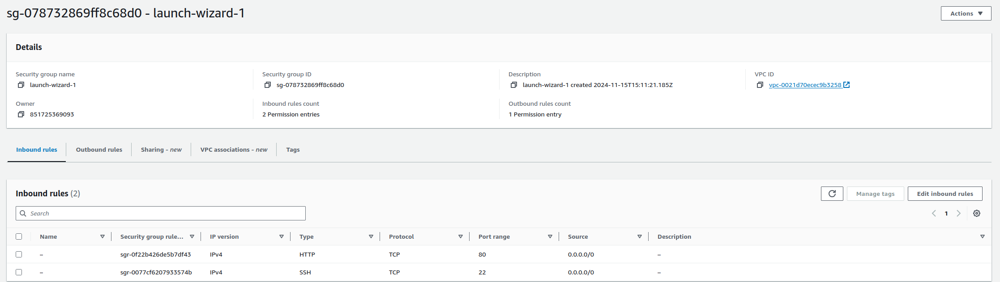
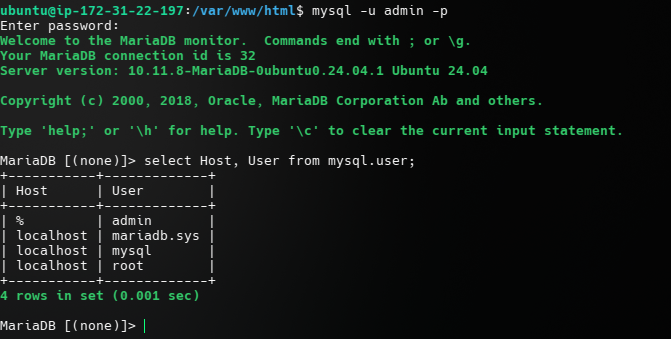

# KN03: laaS (Infrastructure as a Service) - Virtuelle Server

## Installation von Webserver und Datenbank

1. Update des Paketmanagers:

```bash
sudo apt update
```

2. Installation von Apache Webserver:

```bash
sudo apt install apache2
```

3. Installation von PHP:

```bash
sudo apt install php
```

4. Installation libapache2-mod-php:

```bash
sudo apt install libapache2-mod-php
```

- PHP Erweiterung für Apache.

5. Installation von MariaDB:

```bash
sudo apt install mariadb-server
```

- Installiert den Datenbankserver MariaDB.

6. Installation von PHP-MySQLi:

```bash
sudo apt install php-mysqli
```

- PHP-Erweiterung für die Interaktion mit MySQL-Datenbanken.

7. Neuen Admin Benutzer für MariaDB erstellen:

```bash
sudo mysql -sfu root -e "GRANT ALL ON *.* TO 'admin'@'%' IDENTIFIED BY 'pw' WITH GRANT OPTION;"
```

8. Neustart des Apache Webserver und MariaDB:

```bash
sudo systemctl restart apache2
sudo systemctl restart mariadb
```

## Seite erstellen

1. Klonen des Repositories:

```bash
git clone https://gitlab.com/ch-tbz-it/Stud/m346/m346scripts.git
```

2. Wechseln in das Verzeichnis:

```bash
cd m346scripts
```

3. Eingabe des Datenbank Passworts in `db.php`:

```php
<?php
        //database
        $servername = "127.0.0.1";
        $username = "admin";
        $password = "???"; // Hier das Passwort eintragen
        $dbname = "mysql";

        // Create connection
        $conn = new mysqli($servername, $username, $password, $dbname);
        // Check connection
        if ($conn->connect_error) {
                die("Connection failed: " . $conn->connect_error);
        }

        $sql = "select Host, User from mysql.user;";
        $result = $conn->query($sql);
        while($row = $result->fetch_assoc()){
                echo("<li>" . $row["Host"] . " / " . $row["User"] . "</li>");
        }
        //var_dump($result);
?>
</body
```

4. Kopieren der Dateien in das Webverzeichnis:

```bash
sudo cp -r * /var/www/html
```

## Firewall konfigurieren und Sicherheitsgruppe anpassen

Zu diesem Zeitpunkt können Sie noch keine Seiten aufrufen, weil die Sicherheitsgruppe dies noch nicht zulässt.

1. Öffnen des Ports 80 und 22:

```bash
sudo ufw allow 80/tcp
sudo ufw allow 22/tcp
```

2. `ufw` aktivieren:

```bash
sudo ufw enable
```

3. Überprüfen des Status von `ufw`:

```bash
sudo ufw status
```

4. Anpassen der Sicherheitsgruppe in der Cloud:

- Öffnen Sie die Konsole Ihrer Cloud-Plattform.
- Navigieren Sie zu den Sicherheitsgruppen.
- Öffnen Sie die Sicherheitsgruppe, die Ihrem Server zugewiesen ist.
- Fügen Sie eine Regel hinzu, um den Datenverkehr auf Port 80 zuzulassen.
- Fügen Sie eine Regel hinzu, um den Datenverkehr auf Port 22 zuzulassen.
- Speichern Sie die Änderungen und überprüfen Sie, ob die Seite jetzt über den Browser erreichbar ist.

> [!NOTE]
> **Inbound und Outbound Regeln**
>
> Inbound-Regeln steuern den eingehenden Datenverkehr auf den Server, während Outbound-Regeln den ausgehenden Datenverkehr steuern. Es ist wichtig, die richtigen Regeln für die Sicherheitsgruppe festzulegen, um den Datenverkehr auf den erforderlichen Ports zuzulassen. Wenn z.B. Port 80 für das Web zugänglich sein soll, muss eine Inbound-Regel für Port 80 hinzugefügt werden. 

## Nachweis

**index.html**:



**info.php**:



**db.php**:



**Regeln in der Sicherheitsgruppe**:



**MySQL Abfrage im Terminal**:



## Checkpoints

- `sudo`: `sudo` ist ein Befehl, der es einem erlaubt, Befehle als anderen Benutzer auszuführen. In der Regel wird `sudo` verwendet, um Befehle als `root` auszuführen.
- `apt`: `apt` (Advanced Package Tool) ist ein Paketverwaltungssystem, das in Debian-basierten Distributionen verwendet wird. Es wird verwendet, um Pakete zu installieren, zu aktualisieren und zu entfernen.
- `apache2`: `apache2` ist ein Webserver, der in der Regel auf Linux-Systemen verwendet wird. Es wird verwendet, um Webseiten und Webanwendungen zu hosten.
- `php`: `php` ist eine serverseitige Skriptsprache, die in der Regel für die Entwicklung von Webanwendungen verwendet wird. Es wird häufig in Verbindung mit einem Webserver wie Apache verwendet.
- `mariaDB`: `mariaDB` ist ein relationales Datenbankverwaltungssystem, das als Ersatz für MySQL verwendet werden kann. Es wird häufig in Verbindung mit Webanwendungen verwendet, um Daten zu speichern und abzurufen.
- `libapache2-mod-php`: `libapache2-mod-php` ist ein Apache-Modul, das es ermöglicht, PHP-Skripte auf einem Apache-Webserver auszuführen. Es wird verwendet, um PHP-Dateien zu verarbeiten und dynamische Webinhalte zu generieren.
- `php-msqli`: `php-msqli` ist eine PHP-Erweiterung, die es ermöglicht, mit einer MySQL-Datenbank zu interagieren. Es wird verwendet, um Datenbankabfragen in PHP-Skripten auszuführen und Daten zu speichern und abzurufen.
- Mysql wichtige Befehle:
  - `mysql -u root -p`: Verbindung zur MySQL-Datenbank als `root`-Benutzer herstellen.
  - `show databases;`: Alle Datenbanken anzeigen.
  - `create database dbname;`: Neue Datenbank erstellen.
  - `use dbname;`: Zu einer bestimmten Datenbank wechseln.
  - `show tables;`: Alle Tabellen in der aktuellen Datenbank anzeigen.
  - `create table tablename (column1 datatype, column2 datatype, ...);`: Neue Tabelle erstellen.
  - `insert into tablename (column1, column2, ...) values (value1, value2, ...);`: Datensätze in eine Tabelle einfügen.
  - `select * from tablename;`: Alle Datensätze aus einer Tabelle abrufen.
  - `update tablename set column1=value1, column2=value2 where condition;`: Datensätze in einer Tabelle aktualisieren.
  - `delete from tablename where condition;`: Datensätze aus einer Tabelle löschen.
- Port Sicherheitgruppen und Firewall: Ports sind Kommunikationsendpunkte, die es Anwendungen ermöglichen, miteinander zu kommunizieren. Sicherheitsgruppen und Firewalls werden verwendet, um den Datenverkehr auf bestimmten Ports zu steuern und zu filtern.
- `systemctl`: `systemctl` ist ein Befehl, der in Systemd-basierten Linux-Distributionen verwendet wird, um Systemd-Dienste zu verwalten. Es wird verwendet, um Dienste zu starten, zu stoppen, zu aktivieren und zu deaktivieren.
