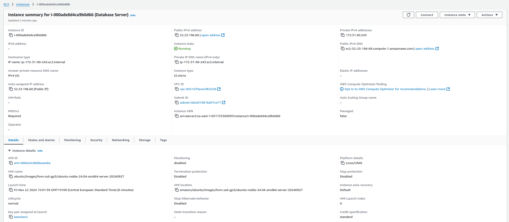
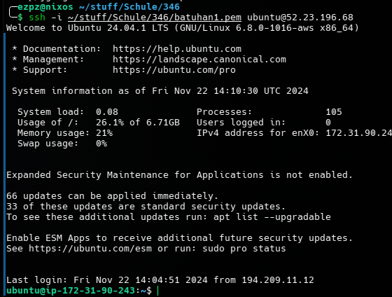
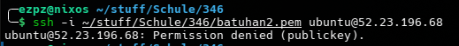
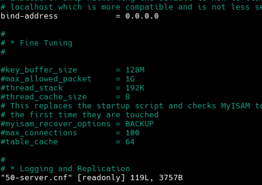
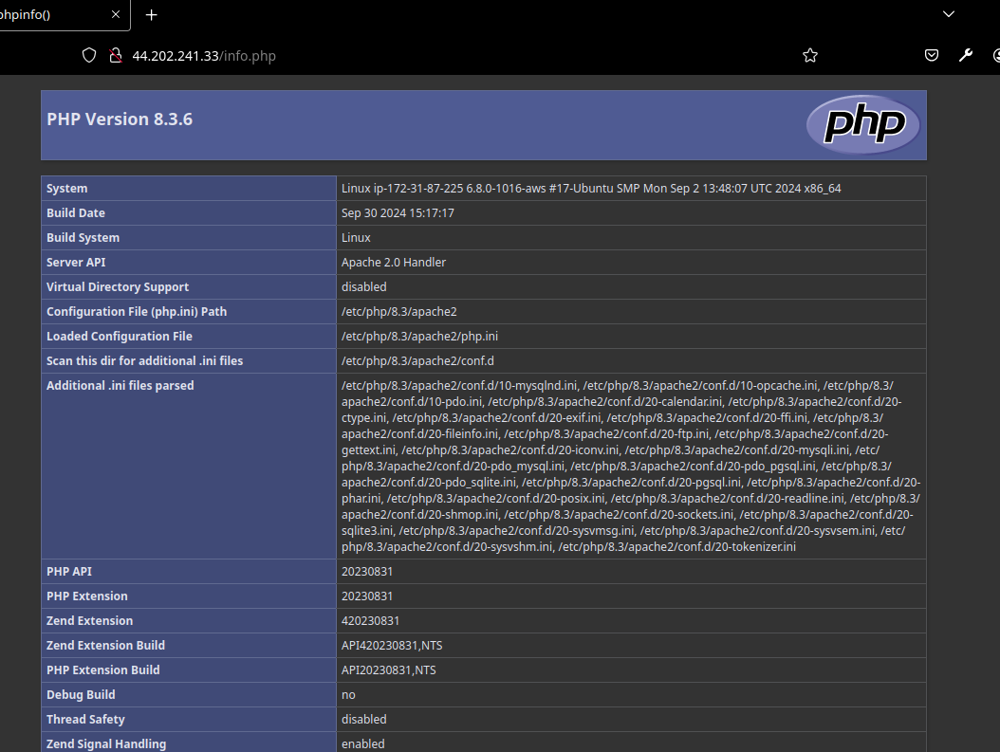
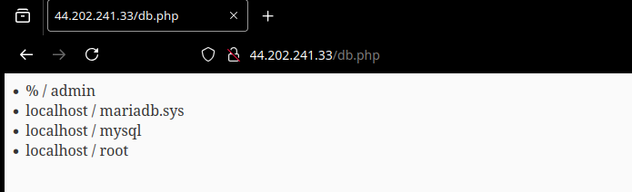
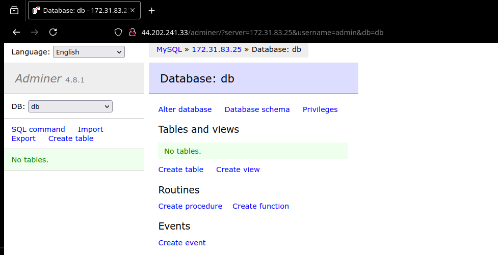

# KN04: Cloud-init und AWS

## YAML

`yaml` (Yet Another Markup Language) ist eine einfache Datenbeschreibungssprache, die in der Cloud verwendet wird, um Konfigurationen zu beschreiben. Sie ist einfach zu lesen und zu schreiben und wird in vielen Cloud-Plattformen verwendet.

Ein einfaches Beispiel für `yaml` als Konfigurationsdatei für `cloud-init`:

```yaml
#cloud-config
package_upgrade: true
packages:
  - apache2
  - php
  - mysql-server
runcmd:
  - echo "Hello, World!" > /var/www/html/index.html
```

In diesem Beispiel wird `cloud-init` verwendet, um ein `apache2` Webserver, `php` und `mysql-server` zu installieren und eine einfache `index.html` Datei zu erstellen.

## Cloud-init Datei

Cloud-init ist ein Dienst, der in der Cloud verwendet wird, um Konfigurationen auf virtuellen Maschinen zu initialisieren. Es wird verwendet, um Software zu installieren, Dateien zu erstellen und andere Konfigurationen durchzuführen.

Hier ist die bereitgestellte `cloud-init.yaml` Datei mit Beschreibung:

```yaml
#cloud-config
users:
  - name: ubuntu # Benutzername
    sudo: ALL=(ALL) NOPASSWD:ALL # sudo Berechtigungen
    groups: users, admin # Gruppen
    home: /home/ubuntu # Home-Verzeichnis
    shell: /bin/bash # Shell
    ssh_authorized_keys: # SSH Public Key zum Verbinden
      - ssh-rsa
ssh_pwauth: false # SSH Passwort Authentifizierung
disable_root: false # Root Benutzer deaktivieren
package_update: true # Paketaktualisierung
packages: # Pakete installieren
  - curl
  - wget
```

**Instanz**:



_Abbildung 1: Instanz Informationen_

**SSH**:



_Abbildung 2: SSH Verbindung mit dem ersten Key_



_Abbildung 3: SSH Verbindung mit dem zweiten Key_

**Cloud-init-output.log**:

```bash
Cloud-init v. 24.3.1-0ubuntu0~24.04.1 running 'init-local' at Fri, 22 Nov 2024 14:02:15 +0000. Up 9.10 seconds.
Cloud-init v. 24.3.1-0ubuntu0~24.04.1 running 'init' at Fri, 22 Nov 2024 14:02:19 +0000. Up 13.68 seconds.
ci-info: +++++++++++++++++++++++++++++++++++++++Net device info+++++++++++++++++++++++++++++++++++++++
ci-info: +--------+------+------------------------------+---------------+--------+-------------------+
ci-info: | Device |  Up  |           Address            |      Mask     | Scope  |     Hw-Address    |
ci-info: +--------+------+------------------------------+---------------+--------+-------------------+
ci-info: |  enX0  | True |        172.31.90.243         | 255.255.240.0 | global | 12:97:10:40:f9:6d |
ci-info: |  enX0  | True | fe80::1097:10ff:fe40:f96d/64 |       .       |  link  | 12:97:10:40:f9:6d |
ci-info: |   lo   | True |          127.0.0.1           |   255.0.0.0   |  host  |         .         |
ci-info: |   lo   | True |           ::1/128            |       .       |  host  |         .         |
ci-info: +--------+------+------------------------------+---------------+--------+-------------------+
ci-info: ++++++++++++++++++++++++++++++Route IPv4 info++++++++++++++++++++++++++++++
ci-info: +-------+-------------+-------------+-----------------+-----------+-------+
ci-info: | Route | Destination |   Gateway   |     Genmask     | Interface | Flags |
ci-info: +-------+-------------+-------------+-----------------+-----------+-------+
ci-info: |   0   |   0.0.0.0   | 172.31.80.1 |     0.0.0.0     |    enX0   |   UG  |
ci-info: |   1   |  172.31.0.2 | 172.31.80.1 | 255.255.255.255 |    enX0   |  UGH  |
ci-info: |   2   | 172.31.80.0 |   0.0.0.0   |  255.255.240.0  |    enX0   |   U   |
ci-info: |   3   | 172.31.80.1 |   0.0.0.0   | 255.255.255.255 |    enX0   |   UH  |
ci-info: +-------+-------------+-------------+-----------------+-----------+-------+
ci-info: +++++++++++++++++++Route IPv6 info+++++++++++++++++++
ci-info: +-------+-------------+---------+-----------+-------+
ci-info: | Route | Destination | Gateway | Interface | Flags |
ci-info: +-------+-------------+---------+-----------+-------+
ci-info: |   0   |  fe80::/64  |    ::   |    enX0   |   U   |
ci-info: |   2   |    local    |    ::   |    enX0   |   U   |
ci-info: |   3   |  multicast  |    ::   |    enX0   |   U   |
ci-info: +-------+-------------+---------+-----------+-------+
2024-11-22 14:02:19,717 - schema.py[WARNING]: cloud-config failed schema validation! You may run 'sudo cloud-init schema --system' to check the details.
Generating public/private rsa key pair.
Your identification has been saved in /etc/ssh/ssh_host_rsa_key
Your public key has been saved in /etc/ssh/ssh_host_rsa_key.pub
The key fingerprint is:
SHA256:XNijkY+ToMb8L668ceMRK8K42KWue0wqfKLOXl+4d9M root@ip-172-31-90-243
The key's randomart image is:
+---[RSA 3072]----+
|                 |
|         +       |
|      . + +      |
|   o . o B .     |
|    = . S .      |
| o.. ..o .       |
|o+o.+.*.  .      |
|==+*.=+= o E     |
|@O* +*+.o .      |
+----[SHA256]-----+
Generating public/private ecdsa key pair.
Your identification has been saved in /etc/ssh/ssh_host_ecdsa_key
Your public key has been saved in /etc/ssh/ssh_host_ecdsa_key.pub
The key fingerprint is:
SHA256:krbWXXCtktXXaEIq8TCTtN04++7HmdqfwjkQYz5qn8o root@ip-172-31-90-243
The key's randomart image is:
+---[ECDSA 256]---+
|       .*.  .    |
|        .O = o ..|
|        o B = = o|
|       . . @ + . |
|      + S * =    |
|     . + . B     |
|      o . o =..o |
|     .  .o ..*= .|
|        .Eo++o+o.|
+----[SHA256]-----+
Generating public/private ed25519 key pair.
Your identification has been saved in /etc/ssh/ssh_host_ed25519_key
Your public key has been saved in /etc/ssh/ssh_host_ed25519_key.pub
The key fingerprint is:
SHA256:lehiMhIN1M812jd4x3t6uXoSp+WcgxiX2dDWL95Fueg root@ip-172-31-90-243
The key's randomart image is:
+--[ED25519 256]--+
| .o.             |
|   o.   o. .     |
|  . .o +.oo. . ..|
|   .  +.o.+ + o.o|
|  . o o So o B..o|
|   . + .  . *.*.o|
|           +.% =.|
|          . =EX .|
|            .=.o |
+----[SHA256]-----+
Cloud-init v. 24.3.1-0ubuntu0~24.04.1 running 'modules:config' at Fri, 22 Nov 2024 14:02:22 +0000. Up 16.73 seconds.
Cloud-init v. 24.3.1-0ubuntu0~24.04.1 running 'modules:final' at Fri, 22 Nov 2024 14:02:26 +0000. Up 20.58 seconds.
Hit:1 http://us-east-1.ec2.archive.ubuntu.com/ubuntu noble InRelease
Get:2 http://us-east-1.ec2.archive.ubuntu.com/ubuntu noble-updates InRelease [126 kB]
Get:3 http://us-east-1.ec2.archive.ubuntu.com/ubuntu noble-backports InRelease [126 kB]
Get:4 http://security.ubuntu.com/ubuntu noble-security InRelease [126 kB]
Get:5 http://us-east-1.ec2.archive.ubuntu.com/ubuntu noble/universe amd64 Packages [15.0 MB]
Get:6 http://security.ubuntu.com/ubuntu noble-security/main amd64 Packages [496 kB]
Get:7 http://us-east-1.ec2.archive.ubuntu.com/ubuntu noble/universe Translation-en [5982 kB]
Get:8 http://us-east-1.ec2.archive.ubuntu.com/ubuntu noble/universe amd64 Components [3871 kB]
Get:9 http://us-east-1.ec2.archive.ubuntu.com/ubuntu noble/universe amd64 c-n-f Metadata [301 kB]
Get:10 http://us-east-1.ec2.archive.ubuntu.com/ubuntu noble/multiverse amd64 Packages [269 kB]
Get:11 http://us-east-1.ec2.archive.ubuntu.com/ubuntu noble/multiverse Translation-en [118 kB]
Get:12 http://us-east-1.ec2.archive.ubuntu.com/ubuntu noble/multiverse amd64 Components [35.0 kB]
Get:13 http://us-east-1.ec2.archive.ubuntu.com/ubuntu noble/multiverse amd64 c-n-f Metadata [8328 B]
Get:14 http://us-east-1.ec2.archive.ubuntu.com/ubuntu noble-updates/main amd64 Packages [670 kB]
Get:15 http://us-east-1.ec2.archive.ubuntu.com/ubuntu noble-updates/main Translation-en [157 kB]
Get:16 http://us-east-1.ec2.archive.ubuntu.com/ubuntu noble-updates/main amd64 Components [131 kB]
Get:17 http://us-east-1.ec2.archive.ubuntu.com/ubuntu noble-updates/main amd64 c-n-f Metadata [10.4 kB]
Get:18 http://us-east-1.ec2.archive.ubuntu.com/ubuntu noble-updates/universe amd64 Packages [718 kB]
Get:19 http://us-east-1.ec2.archive.ubuntu.com/ubuntu noble-updates/universe Translation-en [213 kB]
Get:20 http://us-east-1.ec2.archive.ubuntu.com/ubuntu noble-updates/universe amd64 Components [309 kB]
Get:21 http://us-east-1.ec2.archive.ubuntu.com/ubuntu noble-updates/universe amd64 c-n-f Metadata [19.9 kB]
Get:22 http://us-east-1.ec2.archive.ubuntu.com/ubuntu noble-updates/restricted amd64 Packages [480 kB]
Get:23 http://us-east-1.ec2.archive.ubuntu.com/ubuntu noble-updates/restricted Translation-en [92.5 kB]
Get:24 http://us-east-1.ec2.archive.ubuntu.com/ubuntu noble-updates/restricted amd64 Components [212 B]
Get:25 http://us-east-1.ec2.archive.ubuntu.com/ubuntu noble-updates/restricted amd64 c-n-f Metadata [424 B]
Get:26 http://us-east-1.ec2.archive.ubuntu.com/ubuntu noble-updates/multiverse amd64 Packages [15.0 kB]
Get:27 http://us-east-1.ec2.archive.ubuntu.com/ubuntu noble-updates/multiverse Translation-en [3820 B]
Get:28 http://us-east-1.ec2.archive.ubuntu.com/ubuntu noble-updates/multiverse amd64 Components [940 B]
Get:29 http://us-east-1.ec2.archive.ubuntu.com/ubuntu noble-updates/multiverse amd64 c-n-f Metadata [552 B]
Get:30 http://us-east-1.ec2.archive.ubuntu.com/ubuntu noble-backports/main amd64 Components [208 B]
Get:31 http://us-east-1.ec2.archive.ubuntu.com/ubuntu noble-backports/main amd64 c-n-f Metadata [112 B]
Get:32 http://us-east-1.ec2.archive.ubuntu.com/ubuntu noble-backports/universe amd64 Packages [10.7 kB]
Get:33 http://us-east-1.ec2.archive.ubuntu.com/ubuntu noble-backports/universe Translation-en [10.8 kB]
Get:34 http://us-east-1.ec2.archive.ubuntu.com/ubuntu noble-backports/universe amd64 Components [21.8 kB]
Get:35 http://us-east-1.ec2.archive.ubuntu.com/ubuntu noble-backports/universe amd64 c-n-f Metadata [1104 B]
Get:36 http://us-east-1.ec2.archive.ubuntu.com/ubuntu noble-backports/restricted amd64 Components [216 B]
Get:37 http://us-east-1.ec2.archive.ubuntu.com/ubuntu noble-backports/restricted amd64 c-n-f Metadata [116 B]
Get:38 http://us-east-1.ec2.archive.ubuntu.com/ubuntu noble-backports/multiverse amd64 Components [212 B]
Get:39 http://us-east-1.ec2.archive.ubuntu.com/ubuntu noble-backports/multiverse amd64 c-n-f Metadata [116 B]
Get:40 http://security.ubuntu.com/ubuntu noble-security/main Translation-en [101 kB]
Get:41 http://security.ubuntu.com/ubuntu noble-security/main amd64 Components [7196 B]
Get:42 http://security.ubuntu.com/ubuntu noble-security/main amd64 c-n-f Metadata [5892 B]
Get:43 http://security.ubuntu.com/ubuntu noble-security/universe amd64 Packages [561 kB]
Get:44 http://security.ubuntu.com/ubuntu noble-security/universe Translation-en [149 kB]
Get:45 http://security.ubuntu.com/ubuntu noble-security/universe amd64 Components [51.9 kB]
Get:46 http://security.ubuntu.com/ubuntu noble-security/universe amd64 c-n-f Metadata [13.5 kB]
Get:47 http://security.ubuntu.com/ubuntu noble-security/restricted amd64 Packages [480 kB]
Get:48 http://security.ubuntu.com/ubuntu noble-security/restricted Translation-en [92.5 kB]
Get:49 http://security.ubuntu.com/ubuntu noble-security/restricted amd64 Components [212 B]
Get:50 http://security.ubuntu.com/ubuntu noble-security/restricted amd64 c-n-f Metadata [424 B]
Get:51 http://security.ubuntu.com/ubuntu noble-security/multiverse amd64 Packages [12.2 kB]
Get:52 http://security.ubuntu.com/ubuntu noble-security/multiverse Translation-en [2940 B]
Get:53 http://security.ubuntu.com/ubuntu noble-security/multiverse amd64 Components [208 B]
Get:54 http://security.ubuntu.com/ubuntu noble-security/multiverse amd64 c-n-f Metadata [356 B]
Fetched 30.8 MB in 11s (2695 kB/s)
Reading package lists...
Reading package lists...
Building dependency tree...
Reading state information...
wget is already the newest version (1.21.4-1ubuntu4.1).
wget set to manually installed.
The following additional packages will be installed:
  libcurl3t64-gnutls libcurl4t64
The following packages will be upgraded:
  curl libcurl3t64-gnutls libcurl4t64
3 upgraded, 0 newly installed, 0 to remove and 54 not upgraded.
Need to get 901 kB of archives.
After this operation, 0 B of additional disk space will be used.
Get:1 http://us-east-1.ec2.archive.ubuntu.com/ubuntu noble-updates/main amd64 curl amd64 8.5.0-2ubuntu10.5 [227 kB]
Get:2 http://us-east-1.ec2.archive.ubuntu.com/ubuntu noble-updates/main amd64 libcurl4t64 amd64 8.5.0-2ubuntu10.5 [341 kB]
Get:3 http://us-east-1.ec2.archive.ubuntu.com/ubuntu noble-updates/main amd64 libcurl3t64-gnutls amd64 8.5.0-2ubuntu10.5 [333 kB]
Fetched 901 kB in 0s (24.3 MB/s)
(Reading database ... 67836 files and directories currently installed.)
Preparing to unpack .../curl_8.5.0-2ubuntu10.5_amd64.deb ...
Unpacking curl (8.5.0-2ubuntu10.5) over (8.5.0-2ubuntu10.4) ...
Preparing to unpack .../libcurl4t64_8.5.0-2ubuntu10.5_amd64.deb ...
Unpacking libcurl4t64:amd64 (8.5.0-2ubuntu10.5) over (8.5.0-2ubuntu10.4) ...
Preparing to unpack .../libcurl3t64-gnutls_8.5.0-2ubuntu10.5_amd64.deb ...
Unpacking libcurl3t64-gnutls:amd64 (8.5.0-2ubuntu10.5) over (8.5.0-2ubuntu10.4) ...
Setting up libcurl4t64:amd64 (8.5.0-2ubuntu10.5) ...
Setting up libcurl3t64-gnutls:amd64 (8.5.0-2ubuntu10.5) ...
Setting up curl (8.5.0-2ubuntu10.5) ...
Processing triggers for man-db (2.12.0-4build2) ...
Processing triggers for libc-bin (2.39-0ubuntu8.3) ...

Running kernel seems to be up-to-date.

Restarting services...
 systemctl restart packagekit.service

No containers need to be restarted.

No user sessions are running outdated binaries.

No VM guests are running outdated hypervisor (qemu) binaries on this host.
Cloud-init v. 24.3.1-0ubuntu0~24.04.1 finished at Fri, 22 Nov 2024 14:02:52 +0000. Datasource DataSourceEc2Local.  Up 46.39 seconds
```

---

## SSH-Key und Cloud-init

Erstellung einer zweiten Instanz:

Cloud-init Datei für db-server:

```yaml
#cloud-config
users:
  - name: ubuntu
    sudo: ALL=(ALL) NOPASSWD:ALL
    groups: users, admin
    home: /home/ubuntu
    shell: /bin/bash
    ssh_authorized_keys:
      - ssh-rsa
      - ssh-rsa
ssh_pwauth: false
disable_root: false
package_update: true
packages:
  - mariadb-server
  - php-mysqli

runcmd:
  - [
      sh,
      -c,
      'sudo mysql -sfu root -e "GRANT ALL ON *.* TO ''admin''@''%'' IDENTIFIED BY ''pw'' WITH GRANT OPTION;"',
    ]
  - [
      sh,
      -c,
      "sudo sed -i 's/127.0.0.1/0.0.0.0/g' /etc/mysql/mariadb.conf.d/50-server.cnf",
    ]
  - [sh, -c, "sudo systemctl restart mariadb"]
  - [sh, -c, "sudo ufw allow 80/tcp"]
  - [sh, -c, "sudo ufw allow 22/tcp"]
  - [sh, -c, "sudo ufw allow 3306/tcp"]
  - [sh, -c, "sudo ufw enable"]
```

Cloud-init für web-server:

```yaml
#cloud-config
users:
  - name: ubuntu
    sudo: ALL=(ALL) NOPASSWD:ALL
    groups: users, admin
    home: /home/ubuntu
    shell: /bin/bash
    ssh_authorized_keys:
      - ssh-rsa
      - ssh-rsa
ssh_pwauth: false
disable_root: false
package_update: true
packages:
  - apache2
  - php
  - libapache2-mod-php
  - adminer

write_files:
  - path: /var/www/html/db.php
    content: |
      <?php
          $servername = "127.0.0.1";
          $username = "admin";
          $password = "pw";
          $dbname = "mysql";

          $conn = new mysqli($servername, $username, $password, $dbname);
          if ($conn->connect_error) {
              die("Connection failed: " . $conn->connect_error);
          }

          $sql = "select Host, User from mysql.user;";
          $result = $conn->query($sql);
          while ($row = $result->fetch_assoc()) {
              echo("<li>" . $row["Host"] . " / " . $row["User"] . "</li>");
          }
      ?>
  - path: /var/www/html/info.php
    content: |
      <?php
        phpinfo();
      ?>

  - path: /var/www/html/index.html
    content: |
      <html>
        <head><title>Willkommen</title></head>
        <body><h1>Willkommen auf dem Webserver!</h1></body>
      </html>

runcmd:
  - [sh, -c, "sudo a2enconf adminer"]
  - [sh, -c, "sudo systemctl restart apache2"]
  - [sh, -c, "sudo ufw allow 80/tcp"]
  - [sh, -c, "sudo ufw allow 22/tcp"]
  - [sh, -c, "sudo ufw enable"]
```

---

## DB-Server

Cloud-init Datei: [cloud-init-db.yaml](./cloud-init-db.yaml)

Ersetzen von `bind-address` in `/etc/mysql/mariadb.conf.d/50-server.cnf`:



_Abbildung 4: Ersetzen von `bind-address`_

## Web-Server

index.html:


_Abbildung 5: index.html_

info.php:



_Abbildung 6: info.php_

db.php:



_Abbildung 7: db.php_

adminer:


