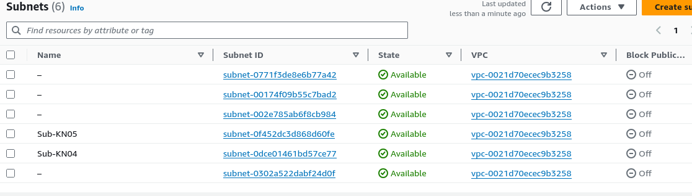
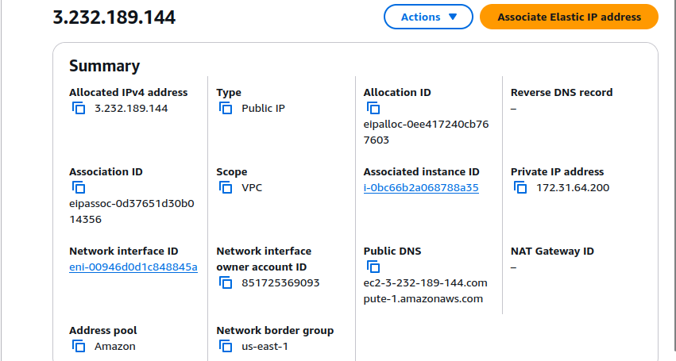
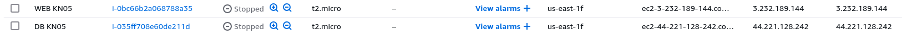
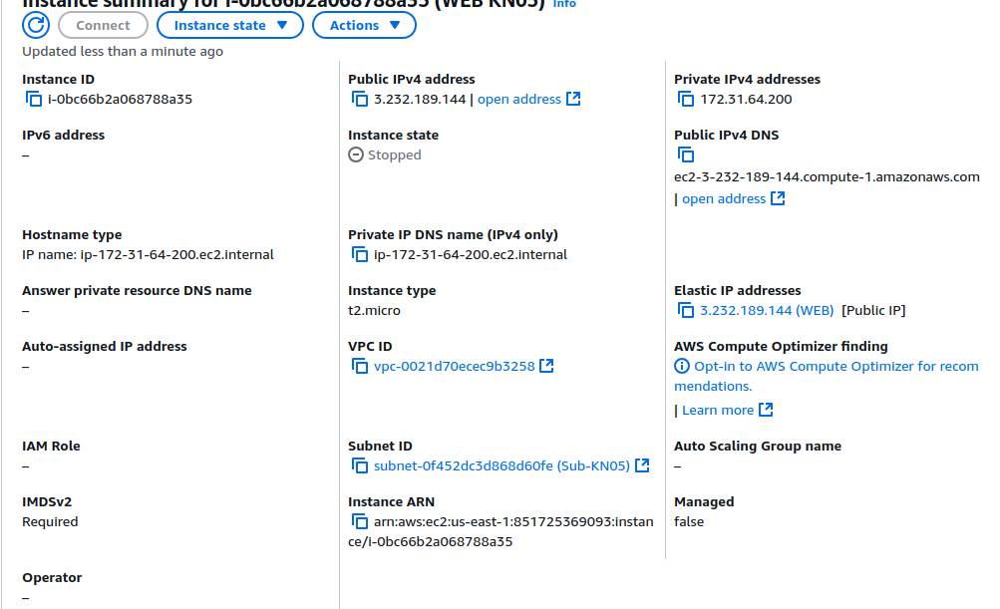
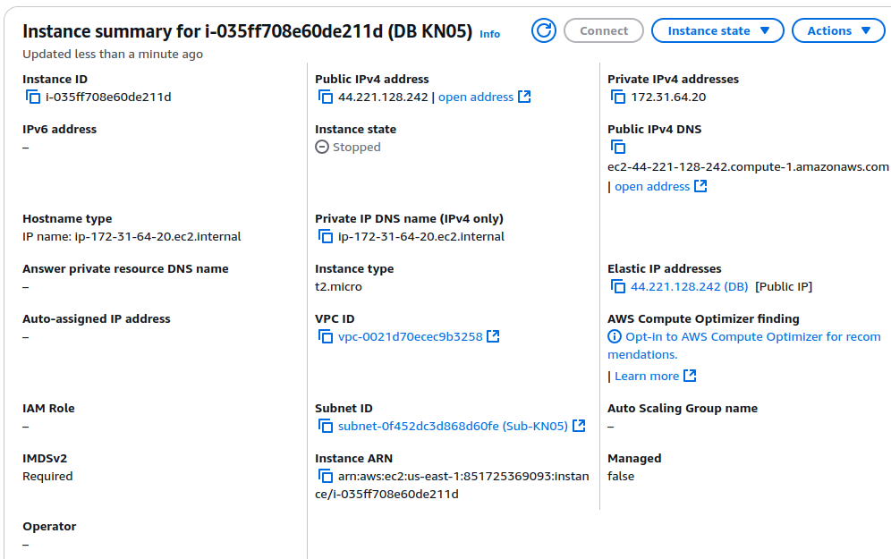

# KN05: Netzwerk/Sicherheit

## Was ist VPC?

Ein **VPC (Virtual Private Cloud)** ist ein virtueller, isolierter Netzwerkbereich innerhalb einer Cloud-Umgebung. Sie ermöglichen die Verwaltung und Bereitstellung von Ressourcen wie virtuellen Maschinen, Datenbanken und Speicher in einer eigenen Umgebung. VPCs sind ein zentraler Bestandteil von Cloud-Computing-Diensten wie Amazon Web Services (AWS), Microsoft Azure und Google Cloud Platform (GCP).

VPC ist wie ein privates Netzwerk in der Cloud, das du kontrolliertst. Du kannst in diesem Netzwerk deine Server, Datenbanken und andere Dienste bereitstellen, miteinander verbinden und absichern.

## Hauptmerkmale von VPC

1. Isolierung:
   - Eine VPC ist von anderen VPCs und den öffentlichen Netzwerken isoliert. Niemand hat Zugriff auf die Ressourcen, ausser es wird explizit erlaubt.
2. Flexibilität:
   - Du kannst die Netzwerkeinstellungen deiner VPC anpassen, um die Anforderungen deiner Anwendung zu erfüllen:
     - IP-Adressbereiche
     - Subnetze
     - Routing
     - Gateway
     - Sicherheitsgruppen
3. Sicherheit:
   - VPCs bieten Sicherheitsmechanismen wie Security Groups und Netzwerk-ACLs (Access Control Lists), um den Zugriff auf die Ressourcen zu kontrollieren.
4. Skalierbarkeit:
   - Du kannst neue Ressourcen wie virtuelle Maschinen oder Datenbanken hinzufügen, ohne die bestehende Architektur zu ändern.
5. Verbindung mit der Aussenwelt:
   - Eine VPC kann entweder komplett privat (nur interne Kommunikation) oder öffentlich (mit dem Internet verbunden) sein. Du kannst auch eine Verbindung zwischen VPCs oder mit deinem lokalen Netzwerk herstellen.

---

## Was ist ein Subnetz?

Ein **Subnetz**, oder Subnetzwerk, ist ein kleinerer Abschnitt eines Netzwerks, der aus einem grösseren Netzwerk, wie z.B. einem VPC, herausgeschnitten wird. Sie helfen dir dabei, das Netzwerk zu organisieren, Ressourcen zu trennen und die Kontrolle über den Datenverkehr zu verbessern.

Stell dir ein Subnetz wie ein **Zimmer in einem grossen Gebäude (dem Netzwerk)** vor. Jedes Zimmer hat eine eigene Funktion und ist von den anderen Räumen getrennt. Du kannst die Türen öffnen und schliessen, um den Zugang zu kontrollieren.

---

### Warum Subnetze verwenden?

1. Organisation:
   - Subnetze helfen dir dabei, das Netzwerk zu organisieren und Ressourcen zu gruppieren.
2. Sicherheit:
   - Subnetze erlauben dir, sensible Ressourcen (z.B. Datenbanken) von anderen Aussenwelt zu isolieren.
3. Effiziente Nutzung von IP-Adressen:
   - Subnetze helfen dir dabei, die verfügbaren IP-Adressen effizient zu nutzen und zu verwalten.
4. Kontrolle über den Datenverkehr:
   - Du kannst den Datenverkehr zwischen den Subnetzen kontrollieren und filtern, um die Sicherheit zu erhöhen.

---

### Wie funktioniert ein Subnetz?

Ein Subnetz wird durch eine **IP-Adresse** und eine **Subnetzmaske** definiert: - **IP-Adresse**: Zeigt den Adressbereich des Netzwerkes an (z.B. `192.168.1.0). - **Subnetzmaske**: Gibt an, wie viele Adressen im Subnetz enthalten sind (z.B. /24 bedeutet 256 Adressen).

- Beispiel:
  - Netzwerk: `192.168.1.0/24`
  - Subnetz 1: `192.168.1.0/26` (64 Adressen)
  - Subnetz 2: `192.168.1.64/26` (64 Adressen)

Das grössere Netzwerk wurde in zwei kleinere Subnetze aufgeteilt.

### Subnetzarten

1. **Public Subnet**:
   - Ein Subnetz, das mit dem Internet verbunden ist und öffentliche IP-Adressen verwendet.
   - Ressourcen wie Webserver oder Load Balancer werden in einem öffentlichen Subnetz bereitgestellt.
   - Benötigt eine Internet Gateway (IGW) für den Zugriff auf das Internet.
2. **Private Subnet**:
   - Ein Subnetz, das nicht mit dem Internet verbunden ist und private IP-Adressen verwendet.
   - Sensible Ressourcen wie Datenbanken oder Anwendungen werden in einem privaten Subnetz bereitgestellt.
   - Kann über ein NAT (Network Address Translation) Gateway auf das Internet zugreifen.

## Subnetze und vordefinierte IPs

**Subnetz für KN04 und KN05**:

_Abbildung 1: Subnetz für KN04 und KN05_

**IP für Web- und DB-Server**:

- DB-Server: `172.31.64.20`
- Web-Server: `172.31.64.200`

## Öffentliche, statische IP

_Abbildung 2: Öffentliche, statische IP für Web-Server_

## Instanzen erstellen

**Liste der gestoppten Instanzen mit IPs**:

_Abbildung 3: Liste der gestoppten Instanzen mit IPs_

**Instanzen mit Subnet ID**:

_Abbildung 4: Web Instanz mit Subnet ID_

_Abbildung 5: DB Instanz mit Subnet ID_
