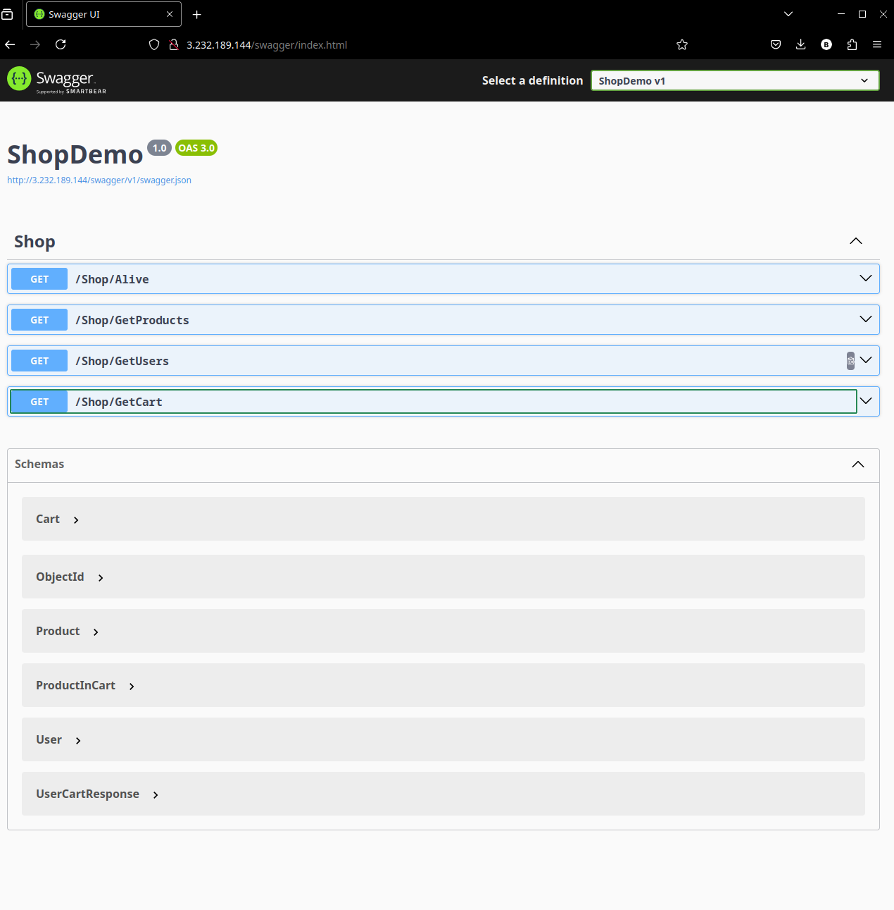
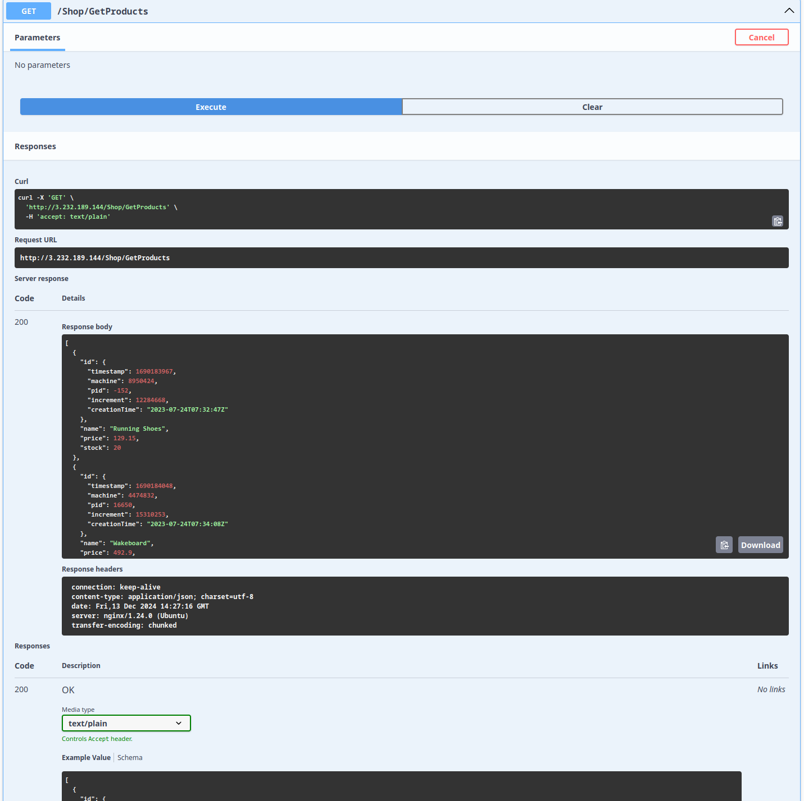
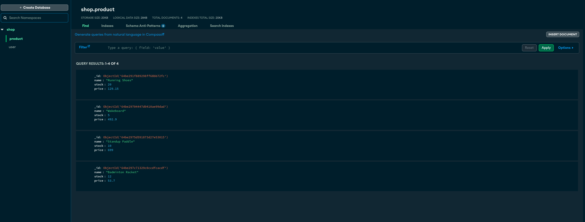
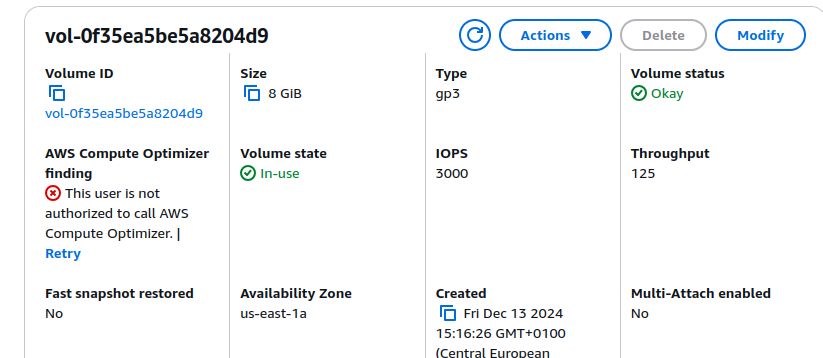
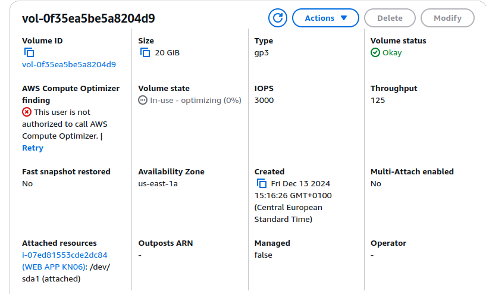
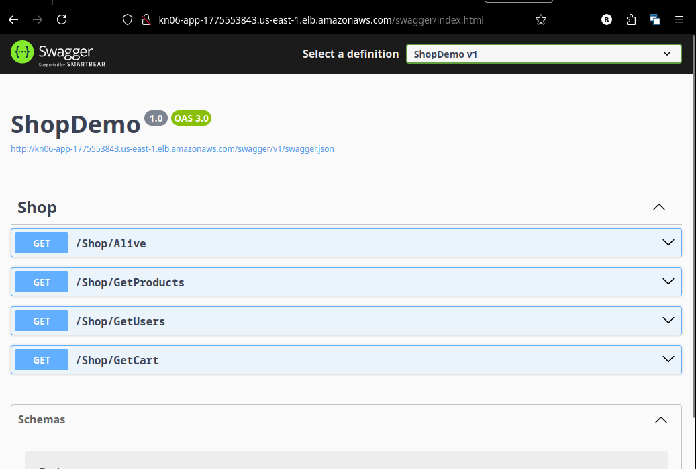

# KN06: Skalierung

## Was ist ein Reverse Proxy?

Ein Reverse Proxy ist ein Server, der als Vermittler zwischen Client und Server fungiert. Er empfängt Anfragen von Clients und leitet sie an die entsprechenden Server weiter.

Verwendungszwecke:

- Lastverteilung
- Caching
- SSL-Terminierung
- Authentifizierung
- Schutz vor Angriffen
- Logging
- Umleitung

## Swagger URL

**URL Aufruf:**



_Abbildung 1: Swagger URL Aufruf_

**GetProducts:**



_Abbildung 2: Swagger "GetProducts"_

**MongoDB Collection:**



_Abbildung 3: MongoDB Collection_

## Probleme mit der Cloud-init Konfiguration in einer produktiven Umgebung

1. **Unsichere Zugangsdaten**: Passwörter und Benutzernamen sind in Klartext hinterlegt.
2. **Unsichere SSH-Konfiguration**: `ssh_pwauth` ist auf `true` gesetzt, was das System für Brute-Force-Angriffe anfällig macht und `disable_root` ist auf `false` gesetzt, was das System für Angriffe auf den Root-Benutzer anfällig macht.
3. **Fehlende Sicherheitsupdates**: Es gibt kein Mechanismus, um Sicherheitsupdates automatisch zu installieren.

```yaml
runcmd:
  - sudo apt-get update && sudo apt-get upgrade -y
```

6. **Ungenutzte und unsichere Git-Repositorys**: Es wird ein Git-Repo ohne Validierung des Inhalts geklont.
7. **Berechtigungen für Dateien und Prozesse**: Anwendungen und Services laufen mit weitreichenden Berechtigungen (`www-data` und `root`). Dies kann missbraucht werden, um das System zu kompromittieren.

## Vertikale Skalierung

Vorher:



_Abbildung 4: 8 GiB Instanz Volumen_

Nachher:



_Abbildung 5: 20 GiB Instanz Volumen_

Im laufenden Betrieb wurde die Instanz von 8 GiB auf 20 GiB vertikal skaliert. Es wird das Volume der Instanz vergrößert, um mehr Speicherplatz zur Verfügung zu stellen.

Mit einem Instanztyp `t2.medium` erfolgt das erweitern des Volumes von 8 GiB auf 20 GiB gleich wie bei einem `t2.micro` Instanztyp.

## Horizontale Skalierung

**Erklärung zum DNS:**

Um die Applikation über die URL `app.tbz-m346.ch` zu erreichen, wird ein DNS-Eintrag beim Domain-Provider erstellt. Der DNS-Eintrag wird auf die Load Balancer DNS URL gesetzt.

Wir setzten hier einen neuen **CNAME**-Eintrag (CNAME = Canonical Name oder Alias) auf die Load Balancer DNS URL.

**DNS-Eintrag:**

```plaintext
app.tbz-m346.ch. 300 IN CNAME <Load Balancer DNS URL>
```

**Aufruf der Instanz über Load Balancer DNS URL:**



_Abbildung 5: Load Balancer DNS URL_
