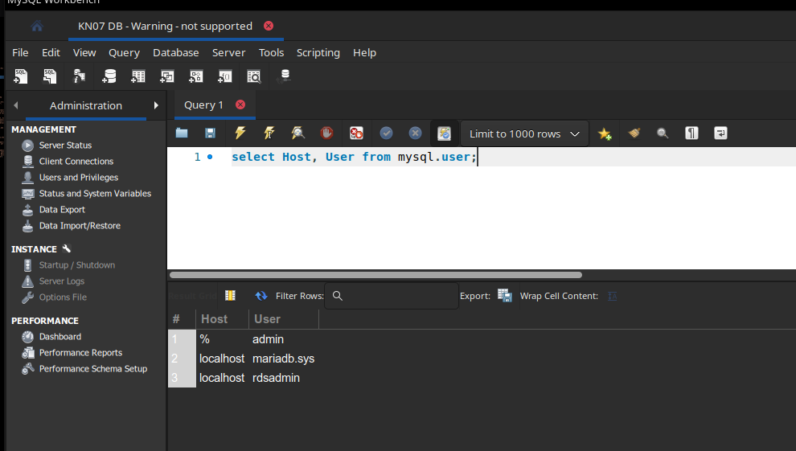
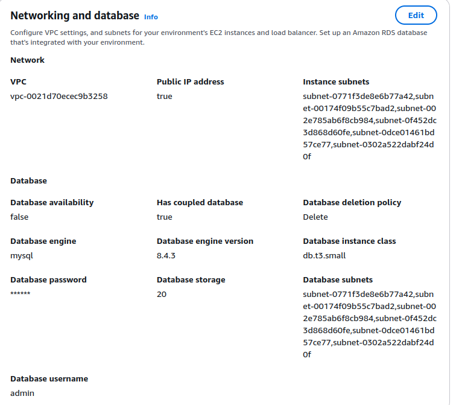
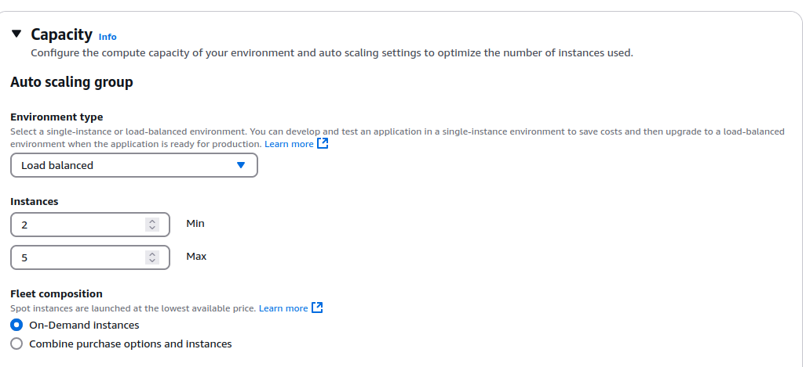
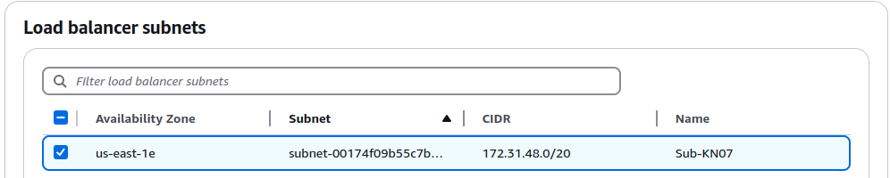
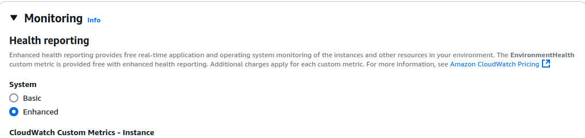
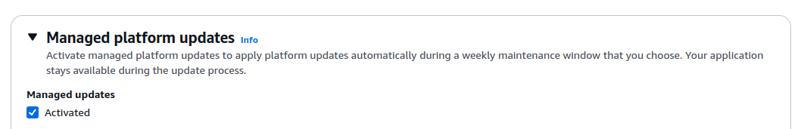
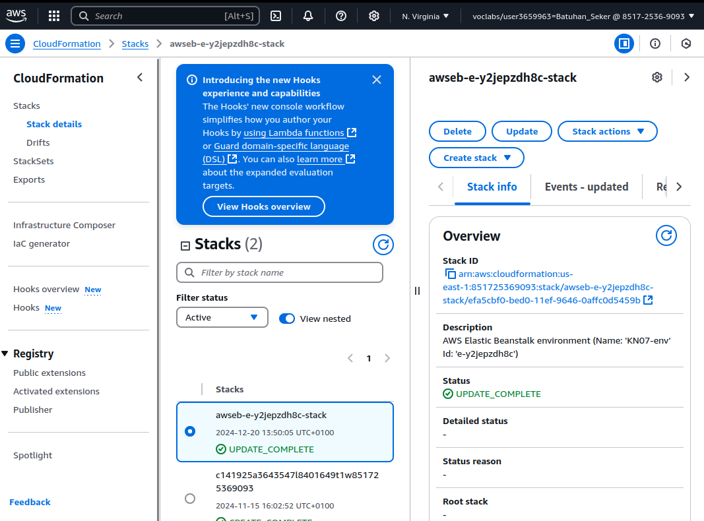
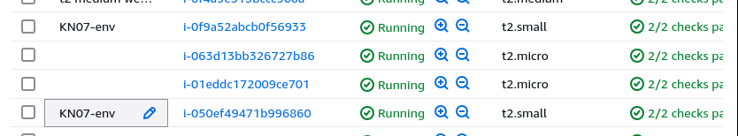

# KN07: PAAS

## Public IP für RDS von AWS

Um eine Public IP für eine RDS von AWS zu erhalten, muss die RDS in einem öffentlichen Subnetz erstellt werden. Das Subnetz muss eine Route zu einem Internet Gateway haben. Die RDS muss in einer Security Group sein, die eingehenden Traffic auf den Port 3306 zulässt.

**Mysql Workbench Query:**

**Wieso PAAS/SAAS anstatt einer eigenen Datenbank?**

**PAAS** (Platform as a Service) und **SAAS** (Software as a Service) bieten viele Vorteile gegenüber einer eigenen Datenbank. Die Vorteile sind:

- **Automatisierung**: Die Datenbank wird automatisch verwaltet und gewartet.
- **Updates**: Updates, Sicherheits-Patches und Backups werden automatisch durchgeführt.
- **Skalierbarkeit**: Die Datenbank kann einfach skaliert werden.
- **Kosten**: Das Pay-as-you-go-Modell ermöglicht es, nur für die tatsächlich genutzten Ressourcen zu bezahlen. Es fallen keine Kosten für Hardware, Software und Wartung an.
- **Zuverlässigkeit**: Dienste bieten hohe Verfügbarkeit und Redundanz.
- **Sicherheit**: Dienste bieten hohe Sicherheitsstandards und Verschlüsselung.
- **Geschwindigkeit und Flexibilität**: Datenbanken können innerhalb weniger Minuten eingerichtet und konfiguriert werden. Sie können auch einfach an die Anforderungen angepasst werden.

## PAAS Applikation

**Veränderte Bereiche:**

- Datenbank festeglegt:
  
  Wir erstellen eine MySQL in für das Applikations Environment. Somit wird die Datenbank in der Applikation verwendet.

- Auto Scaling aktiviert:
  
  Wir können direkt in den Environment Einstellungen das Auto Scaling aktivieren.

- Subnet ausgewählt:
  
  Wir wählen das Subnet aus, in dem die Applikation laufen soll.

- Monitoring aktiviert:
  
  Wir aktivieren das Monitoring für die Applikation und stellen diese auf erweitert.

- Managed Platform updates aktiviert:
  
  Mit den erweiterten Monitoring Einstellungen können wir die Managed Platform Updates aktivieren.

## Erstellte Ressourcen/Objekte und CloudFormation

**Was ist CloudFormation?**

**AWS CloudFormation** ist ein Service, der es ermöglicht, Infrastruktur als Code zu erstellen und zu verwalten. Mit CloudFormation können Sie eine Vorlage erstellen, die die Ressourcen und Konfigurationen definiert, die Sie in Ihrer AWS-Umgebung bereitstellen möchten. Sie können die Vorlage dann verwenden, um die Infrastruktur in Ihrer AWS-Umgebung zu erstellen und zu verwalten.

**CloudFormation Ressourcen:**

**Erstellte Ressourcen/Objekte:**

