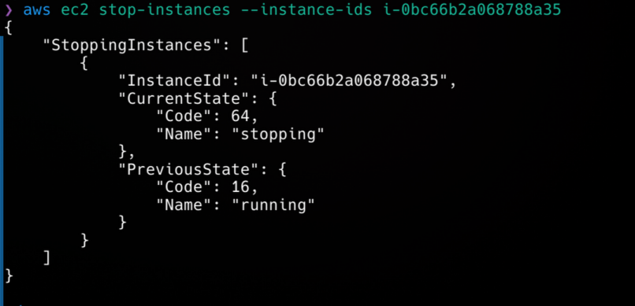
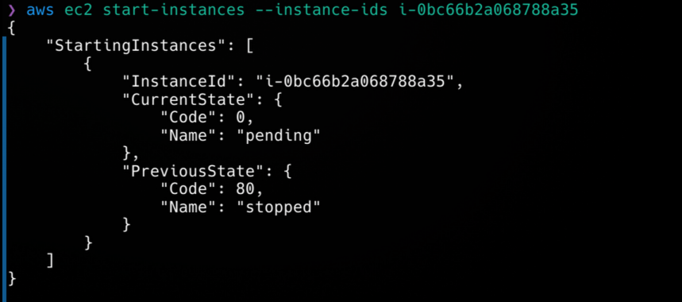
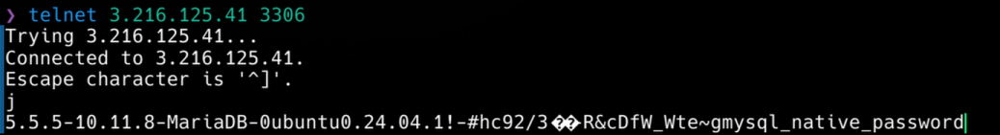
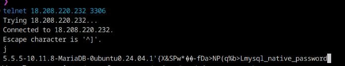

# KN09: Automation

## Automatisierung mit Command Line Interface (CLI)

**Instanz starten und stoppen:**



_Abbildung 1: Instanz stoppen_



_Abbildung 2: Instanz starten_

**Instanz erstellen:**

```bash
aws ec2 run-instances \
    --image-id ami-0e2c8caa4b6378d8c \
    --count 1 \
    --instance-type t2.micro \
    --key-name batuhan2 \
    --security-group-ids sg-011af3c995b18d120 \
    --subnet-id subnet-0302a522dabf24d0f \
    --user-data file://cloud-init-db.yaml \
    --tag-specifications 'ResourceType=instance,Tags=[{Key=Name,Value=KN09-db}]'

```

_Abbildung 3: Instanz erstellen CLI_

```bash
------------------------------------------------------------------------------
|                              DescribeInstances                             |
+----------------------------------------------------------------------------+
||                               Reservations                               ||
|+------------------------------+-------------------------------------------+|
||  OwnerId                     |  851725369093                             ||
||  ReservationId               |  r-0165fdbd472258887                      ||
|+------------------------------+-------------------------------------------+|
|||                                Instances                               |||
||+---------------------------+--------------------------------------------+||
|||  AmiLaunchIndex           |  0                                         |||
|||  Architecture             |  x86_64                                    |||
|||  BootMode                 |  uefi-preferred                            |||
|||  ClientToken              |  09b83490-baa9-47ad-a5ea-06ebbe34b59a      |||
|||  CurrentInstanceBootMode  |  legacy-bios                               |||
|||  EbsOptimized             |  False                                     |||
|||  EnaSupport               |  True                                      |||
|||  Hypervisor               |  xen                                       |||
|||  ImageId                  |  ami-0e2c8caa4b6378d8c                     |||
|||  InstanceId               |  i-0ec1b8381fe746d28                       |||
|||  InstanceType             |  t2.micro                                  |||
|||  KeyName                  |  batuhan2                                  |||
|||  LaunchTime               |  2024-12-26T12:06:53.000Z                  |||
|||  PlatformDetails          |  Linux/UNIX                                |||
|||  PrivateDnsName           |  ip-172-31-1-167.ec2.internal              |||
|||  PrivateIpAddress         |  172.31.1.167                              |||
|||  PublicDnsName            |  ec2-3-216-125-41.compute-1.amazonaws.com  |||
|||  PublicIpAddress          |  3.216.125.41                              |||
|||  RootDeviceName           |  /dev/sda1                                 |||
|||  RootDeviceType           |  ebs                                       |||
|||  SourceDestCheck          |  True                                      |||
|||  StateTransitionReason    |                                            |||
|||  SubnetId                 |  subnet-0302a522dabf24d0f                  |||
|||  UsageOperation           |  RunInstances                              |||
|||  UsageOperationUpdateTime |  2024-12-26T12:06:53.000Z                  |||
|||  VirtualizationType       |  hvm                                       |||
|||  VpcId                    |  vpc-0021d70ecec9b3258                     |||
||+---------------------------+--------------------------------------------+||
||||                          BlockDeviceMappings                         ||||
|||+-----------------------------------+----------------------------------+|||
||||  DeviceName                       |  /dev/sda1                       ||||
|||+-----------------------------------+----------------------------------+|||
|||||                                 Ebs                                |||||
||||+------------------------------+-------------------------------------+||||
|||||  AttachTime                  |  2024-12-26T12:06:54.000Z           |||||
|||||  DeleteOnTermination         |  True                               |||||
|||||  Status                      |  attached                           |||||
|||||  VolumeId                    |  vol-011df14c525f26147              |||||
||||+------------------------------+-------------------------------------+||||
||||                   CapacityReservationSpecification                   ||||
|||+--------------------------------------------------------+-------------+|||
||||  CapacityReservationPreference                         |  open       ||||
|||+--------------------------------------------------------+-------------+|||
||||                              CpuOptions                              ||||
|||+------------------------------------------------------+---------------+|||
||||  CoreCount                                           |  1            ||||
||||  ThreadsPerCore                                      |  1            ||||
|||+------------------------------------------------------+---------------+|||
||||                            EnclaveOptions                            ||||
|||+--------------------------------------+-------------------------------+|||
||||  Enabled                             |  False                        ||||
|||+--------------------------------------+-------------------------------+|||
||||                          HibernationOptions                          ||||
|||+------------------------------------------+---------------------------+|||
||||  Configured                              |  False                    ||||
|||+------------------------------------------+---------------------------+|||
||||                          MaintenanceOptions                          ||||
|||+-----------------------------------------+----------------------------+|||
||||  AutoRecovery                           |  default                   ||||
|||+-----------------------------------------+----------------------------+|||
||||                            MetadataOptions                           ||||
|||+------------------------------------------------+---------------------+|||
||||  HttpEndpoint                                  |  enabled            ||||
||||  HttpProtocolIpv6                              |  disabled           ||||
||||  HttpPutResponseHopLimit                       |  2                  ||||
||||  HttpTokens                                    |  required           ||||
||||  InstanceMetadataTags                          |  disabled           ||||
||||  State                                         |  applied            ||||
|||+------------------------------------------------+---------------------+|||
||||                              Monitoring                              ||||
|||+-----------------------------+----------------------------------------+|||
||||  State                      |  disabled                              ||||
|||+-----------------------------+----------------------------------------+|||
||||                           NetworkInterfaces                          ||||
|||+---------------------------+------------------------------------------+|||
||||  Description              |                                          ||||
||||  InterfaceType            |  interface                               ||||
||||  MacAddress               |  02:99:34:21:69:ad                       ||||
||||  NetworkInterfaceId       |  eni-0ac1e4c4222025df7                   ||||
||||  OwnerId                  |  851725369093                            ||||
||||  PrivateDnsName           |  ip-172-31-1-167.ec2.internal            ||||
||||  PrivateIpAddress         |  172.31.1.167                            ||||
||||  SourceDestCheck          |  True                                    ||||
||||  Status                   |  in-use                                  ||||
||||  SubnetId                 |  subnet-0302a522dabf24d0f                ||||
||||  VpcId                    |  vpc-0021d70ecec9b3258                   ||||
|||+---------------------------+------------------------------------------+|||
|||||                             Association                            |||||
||||+------------------+-------------------------------------------------+||||
|||||  IpOwnerId       |  amazon                                         |||||
|||||  PublicDnsName   |  ec2-3-216-125-41.compute-1.amazonaws.com       |||||
|||||  PublicIp        |  3.216.125.41                                   |||||
||||+------------------+-------------------------------------------------+||||
|||||                             Attachment                             |||||
||||+---------------------------+----------------------------------------+||||
|||||  AttachTime               |  2024-12-26T12:06:53.000Z              |||||
|||||  AttachmentId             |  eni-attach-0625865253f94a24d          |||||
|||||  DeleteOnTermination      |  True                                  |||||
|||||  DeviceIndex              |  0                                     |||||
|||||  NetworkCardIndex         |  0                                     |||||
|||||  Status                   |  attached                              |||||
||||+---------------------------+----------------------------------------+||||
|||||                               Groups                               |||||
||||+-----------------------+--------------------------------------------+||||
|||||  GroupId              |  sg-011af3c995b18d120                      |||||
|||||  GroupName            |  DB                                        |||||
||||+-----------------------+--------------------------------------------+||||
|||||                         PrivateIpAddresses                         |||||
||||+-------------------------+------------------------------------------+||||
|||||  Primary                |  True                                    |||||
|||||  PrivateDnsName         |  ip-172-31-1-167.ec2.internal            |||||
|||||  PrivateIpAddress       |  172.31.1.167                            |||||
||||+-------------------------+------------------------------------------+||||
||||||                            Association                           ||||||
|||||+-----------------+------------------------------------------------+|||||
||||||  IpOwnerId      |  amazon                                        ||||||
||||||  PublicDnsName  |  ec2-3-216-125-41.compute-1.amazonaws.com      ||||||
||||||  PublicIp       |  3.216.125.41                                  ||||||
|||||+-----------------+------------------------------------------------+|||||
||||                               Placement                              ||||
|||+----------------------------------------+-----------------------------+|||
||||  AvailabilityZone                      |  us-east-1b                 ||||
||||  GroupName                             |                             ||||
||||  Tenancy                               |  default                    ||||
|||+----------------------------------------+-----------------------------+|||
||||                         PrivateDnsNameOptions                        ||||
|||+-----------------------------------------------------+----------------+|||
||||  EnableResourceNameDnsAAAARecord                    |  False         ||||
||||  EnableResourceNameDnsARecord                       |  False         ||||
||||  HostnameType                                       |  ip-name       ||||
|||+-----------------------------------------------------+----------------+|||
||||                            SecurityGroups                            ||||
|||+-----------------------+----------------------------------------------+|||
||||  GroupId              |  sg-011af3c995b18d120                        ||||
||||  GroupName            |  DB                                          ||||
|||+-----------------------+----------------------------------------------+|||
||||                                 State                                ||||
|||+----------------------------+-----------------------------------------+|||
||||  Code                      |  16                                     ||||
||||  Name                      |  running                                ||||
|||+----------------------------+-----------------------------------------+|||
||||                                 Tags                                 ||||
|||+------------------------------+---------------------------------------+|||
||||  Key                         |  Name                                 ||||
||||  Value                       |  KN09-db                              ||||
|||+------------------------------+---------------------------------------+|||
```

_Informationen zur erstellten Instanz_

**Telnet Verbindung auf Port 3306:**



_Abbildung 4: Telnet Verbindung auf Port 3306_

**Befehle um KN05 nachzubilden:**

Security Group erstellen:

```bash
aws ec2 create-security-group --group-name sg-kn05 --description "Security Group for KN05"
```

Security Group Regeln hinzufügen:

```bash
aws ec2 authorize-security-group-ingress \
    --group-id sg-xxxxxxxx \
    --protocol tcp \
    --port 3306 \
    --cidr 0.0.0.0/0
```

Subnet erstellen:

```bash
aws ec2 create-subnet \
    --vpc-id vpc-xxxxxxxx \
    --cidr-block 172.31.32.0/20
    --tag-specifications 'ResourceType=subnet,Tags=[{Key=Name,Value=KN05-subnet}]'
```

Um die Automatisierung zu erreichen, müssen wir die Befehle in einer Datei speichern und diese Datei dann ausführen. Dafür können wir ein Shell-Script erstellen, welches die Befehle in der richtigen Reihenfolge ausführt.

## Terraform

**Auszuführende Befehle:**

```bash
terraform init
terraform plan -out=tfplan
terraform apply tfplan
```

**Telnet Verbindung auf Port 3306 zur Terraform Instanz:**



_Abbildung 5: Telnet Verbindung auf Port 3306 zur Terraform Instanz_

### Fazit

Terraform verwendet deklarative Konfigurationsdatein, die alle Ressourcen und ihre Abhängigkeiten definieren. Terraform erstellt dann die Ressourcen in der richtigen Reihenfolge. Die Abhängigkeiten werden automatisch erkannt und in der korrekten Reihenfolge erstellt. Der aktuelle zustand der Infrastruktur wird zudem gespeichert, was die Verwaltung vereinfacht.
