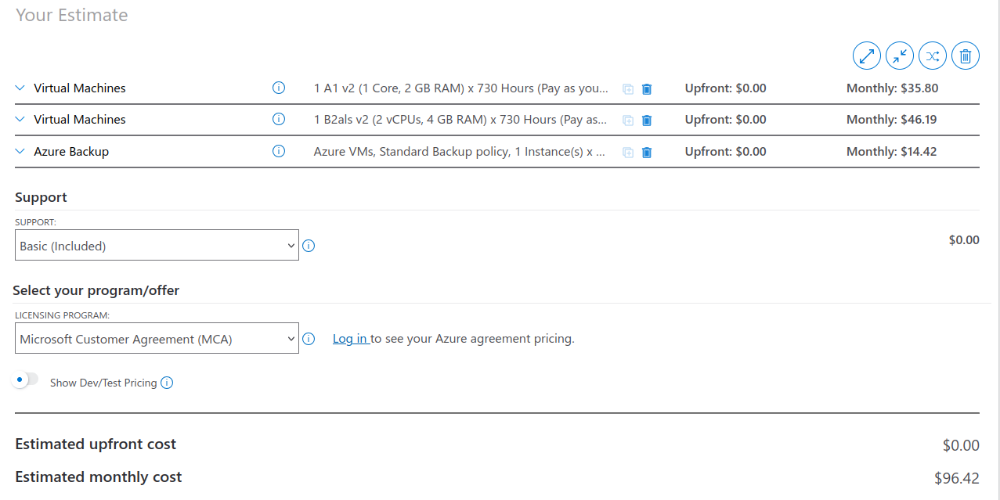
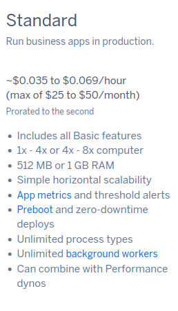
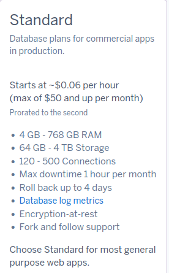
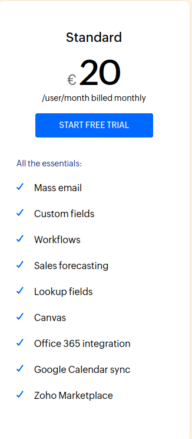
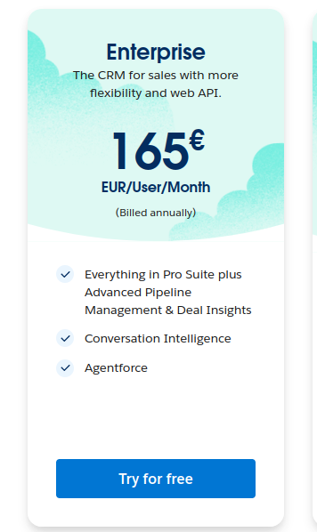

# KN10: Kostenberechnung

## Kostenrechnung IAAS

### AWS-Pricing

[AWS](aws-pricing.pdf)

**Im Monat**: $41.57

### Azure-Pricing

[Azure Sheet](azure-pricing.xlsx)

**Im Monat**: $96.42

## Kostenrechnung PAAS - Replattforming

**Web Server**

**DB**

Nehmen wir an, dass der Web-Server \$0.069 und der DB-Server \$0.06 pro Stunde kostet. So ergibt sich folgende Rechnung:

$$
\text{Web-Server} = 0.069 \times 24 \times 30 = 49.68
$$

$$
\text{DB-Server} = 0.06 \times 24 \times 30 = 43.2
$$

$$
\text{Total} = 49.68 + 43.2 = 92.88
$$

### Begründung zur Auswahl

Der Standard Tier Dyno von Heroku deckt die angegebenen Anforderung ab. Für den Web-Server können wir auf 1GB Ram und 1 vCPU zurückgreifen. Für die Datenbank können wir auf 4GB Ram, 100GB Speicher und 2 vCPU zurückgreifen. Die Kosten sind im Vergleich zu anderen Anbietern höher wenn 2 Dynos verwendet werden. Eine alternative wäre die Verwendung von einem Standard Dyno für beide Anwendungen. Dies würde jedoch die Performance und Sicherhei beeinträchtigen.

### Wieso ist die Cloud-Infrastruktur kostengünstiger als die On-Premise Infrastruktur?

Die Kosten für die On-Premise Infrastruktur sind höher als die Kosten für die Cloud-Infrastruktur. Die On-Premise Infrastruktur erfordert eine hohe Anfangsinvestition, um die Hardware zu kaufen und zu installieren. Die Wartungskosten sind ebenfalls höher, da die Hardware regelmäßig gewartet werden muss. Die Cloud-Infrastruktur erfordert keine hohe Anfangsinvestition und die Wartungskosten sind niedriger. Die Cloud-Infrastruktur bietet auch mehr Flexibilität und Skalierbarkeit, da sie es ermöglicht, Ressourcen nach Bedarf hinzuzufügen oder zu entfernen. Die Cloud-Infrastruktur bietet auch mehr Sicherheit, da die Daten in der Cloud gespeichert sind und nicht auf lokalen Servern.\*\*\*\*

## Kostenrechnung SAAS - Repurchasing

**Zoho CRM Auswahl**

Ich würde hier den Standard Plan wählen, da dieser alle benötigten Funktionen abdeckt. Der Standard Plan kostet 20€/User pro Monat. Bei unseren 30 Usern ergibt sich folgende Rechnung:

$$
\text{Total} = 20 \times 30 = 600
$$

Der Standard Plan von Zoho CRM bietet alle benötigten Funktionen und ist kostengünstig. Der Standard Plan bietet auch eine gute Benutzeroberfläche und ist einfach zu bedienen. Der Standard Plan bietet auch eine gute Integration mit anderen Anwendungen und bietet eine gute Unterstützung.

**Salesforce Sales Cloud Auswahl**

Die einzige sinvolle Option hier wäre die Enterprise Edition. Diese kostet 165€/User pro Monat. Bei unseren 30 Usern ergibt sich folgende Rechnung:

$$
\text{Total} = 165 \times 30 = 4950
$$

Die Enterprise Edition von Salesforce Sales Cloud bietet alle benötigten Funktionen, sie ist aber mit hohen Kosten verbunden. Dafür bekommen wir einige sehr gute Funktionen, wie z.B. AI-gestützte Prognosen, Lead-Scoring und eine erweiterte Berichterstellung.

## Interpratation der Resultate

1. **Kostenvegleich**

| Lösung     | Kosten pro Monat | Begründung                                                         |
| ---------- | ---------------- | ------------------------------------------------------------------ |
| AWS        | ~40€             | Flexibilität und Kontrolle, jedoch höherer Administrationsaufwand. |
| Azure      | ~94€             | Vergleichbare Vorteile wie AWS                                     |
| Heroku     | ~90€             | Einfache Bedienung, jedoch höhere Kosten.                          |
| Zoho       | 600€             | Einfache Bedienung, jedoch höhere Kosten.                          |
| Salesforce | 4950€            | Enthält viele Funktionen, jedoch sehr hohe Kosten.                 |

2. **Aufwand für die Migration**
   - **IAAS (AWS/Azure)**
     - **Aufwand:** Hoch. Die Firma muss die Infrastruktur verwalten, z. B. Betriebssystem, Updates und Backups.
     - **Flexibilität:** Sehr hoch, da die Infrastruktur vollständig anpassbar ist.
   - **PAAS (Heroku):**
     - **Aufwand:** Mittel. Die Plattform übernimmt die Verwaltung vieler grundlegender Aufgaben (z. B. Betriebssystem-Updates).
     - **Flexibilität:** Moderat. Einige Einschränkungen durch die Plattform.
   - **SAAS (Zoho/Salesforce):**
     - **Aufwand:** Gering. Die Software ist sofort einsatzbereit, ohne grossen Setup- oder Wartungsaufwand.
     - **Flexibilität:** Gering. Anpassungen an die spezifischen Anforderungen der Firma sind begrenzt.

## **Fazit**

Die Wahl der Lösung hängt von den Prioritäten der Firma ab:

1. **Kosten:**
   - AWS ist für die IAAS-Lösung am kosteneffizientesten. Azure schneidet viel zu teuer ab. Beide Optionen erfordern jedoch mehr technische Expertise.
   - Heroku eignet sich für eine einfache Migration, ist jedoch teurer.
   - Zoho CRM ist eine günstige SAAS-Lösung, während Salesforce nur bei Bedarf nach erweiterten Funktionen gerechtfertigt ist.
2. **Aufwand:**
   - IAAS-Lösungen erfordern hohe technische Expertise und mehr Zeit für die Verwaltung.
   - PAAS bietet eine gute Balance zwischen Kontrolle und Komfort.
   - SAAS ist ideal, wenn die Firma keine Kapazitäten für technische Verwaltung hat.

**Empfehlung:**

- Für maximale Kontrolle, Kostenersparnis und Flexibilität: **AWS**
- Für einfache Bedienung und schnelle Migration: **Heroku**
- Für die schnellst mögliche Einzastzbereitschaft geringsten Aufwand: **Zoho**
